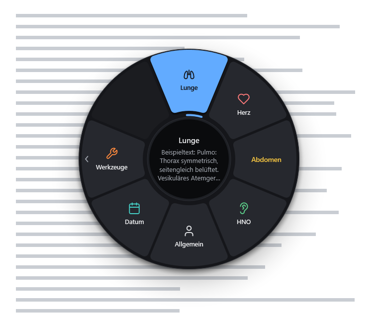
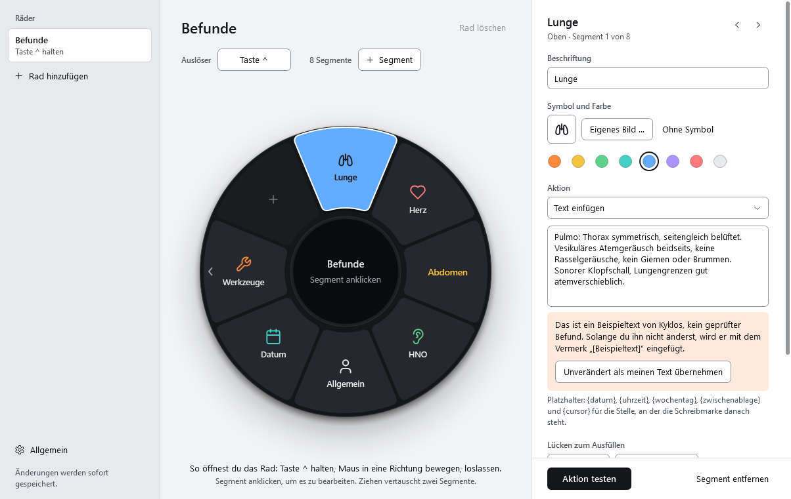

# Kyklos

Ein Auswahlrad für Windows: Taste halten, Maus in eine Richtung bewegen, loslassen – und der hinterlegte Text steht im
Feld, in dem der Cursor schon war. Gebaut für die Praxis, damit Normalbefunde und Textbausteine in unter einer Sekunde in
der Karteikarte stehen, ohne dass der Blick sie verlässt. Dazu Tastenkombinationen, Programme, Websites, Medientasten,
Makros und Unterräder – eine frei belegbare Schaltzentrale, bedient wie ein Auswahlrad aus Computerspielen.



Ein Projekt von [Asklaion](https://asklaion.de) – kostenlose Programme von einem Hausarzt für Arztpraxen. Kostenlos und
quelloffen unter der MIT-Lizenz. „Kyklos" ist griechisch für Kreis bzw. Rad.

## Herunterladen

**[Kyklos.exe aus dem neuesten Release laden](https://github.com/lollylan/Kyklos/releases/latest)** – eine einzelne Datei
(ca. 380 KB), keine Installation, keine Administratorrechte. Läuft auf jedem Windows 10/11 (nutzt das in Windows
enthaltene .NET Framework 4.8).

Die Exe in einen eigenen Ordner legen (z. B. `Dokumente\Kyklos` oder auf einen USB-Stick); die Konfiguration entsteht
daneben. Weil die Exe nicht signiert ist, warnt Windows beim ersten Start einer heruntergeladenen Datei: bei SmartScreen
auf „Weitere Informationen" → „Trotzdem ausführen" klicken, oder vorher in den Dateieigenschaften „Zulassen" anhaken.
Mehr dazu unter [Grenzen](#grenzen).

## Benutzen



1. `Kyklos.exe` starten. Beim ersten Start öffnen sich die Einstellungen, danach sitzt das Programm im Infobereich
   neben der Uhr (Linksklick: Einstellungen, Rechtsklick: Pausieren / Beenden).
2. In ein Textfeld klicken, **`^` halten** (die Taste links oben unter Esc) – das Rad erscheint am Mauszeiger.
3. Maus in Richtung eines Segments bewegen. Die Taste leuchtet, die Mitte zeigt, was gleich eingefügt wird.
4. **Loslassen** löst aus. Zeiger und Zwischenablage sind danach wieder wie vorher.

| Geste | Wirkung |
|---|---|
| Halten, Richtung, loslassen | Segment auslösen – die Auswahl gilt ab der Mitte beliebig weit nach außen |
| In der Mitte loslassen, Esc oder Rechtsklick | Abbrechen |
| Kurz antippen | Rad bleibt offen; ein Linksklick wählt (abschaltbar unter *Allgemein*) |
| Über den Außenrand eines Unterrad-Segments fahren oder kurz darauf verweilen | Unterrad öffnet sich am Zeiger |

`Umschalt + ^` (das Gradzeichen °) und alle anderen Kombinationen mit `^` funktionieren weiter; nur die Taste allein
öffnet das Rad. Wer `^` selbst braucht, legt in den Einstellungen einen anderen Auslöser fest.

## Einrichten

Links die Räder, in der Mitte das Rad zum Anklicken, rechts das gewählte Segment. Alles wird sofort gespeichert und gilt
sofort.

- **Auslöser** pro Rad: einzelne Taste, Kombination (z. B. Strg + Leertaste), Maus-Seitentaste oder mittlere Maustaste.
  Schaltfläche anklicken, Taste drücken. Über **Zweiter Auslöser** öffnet dasselbe Rad auch mit einer weiteren Taste oder
  Kombination (z. B. `^` oder Strg + Leertaste); das × daneben entfernt ihn wieder.
- **Segmente**: 2 bis 12 pro Rad. Ziehen vertauscht zwei Segmente, die Pfeile im Inspektor verschieben eins.
- **Beschriftung, Symbol, Farbe**: Text und/oder Symbol aus der Auswahl oder ein eigenes Bild (PNG, JPG, ICO … oder das
  Symbol einer Exe). Bilder werden verkleinert in der Konfiguration abgelegt.
- **Aktion testen** startet nach 3 Sekunden – in dieser Zeit ins Zielfeld klicken.
- **Aussehen** unter *Allgemein*: Graphit (dunkel, Standard), Hell, Milchglas (der Bildschirm schimmert weichgezeichnet
  durch das Rad), Halloween (in der Mitte ein Auge, das dem Mauszeiger folgt) und Weihnachten (Lichterkette, Schnee,
  Schneekugel in der Mitte).

### Aktionen

| Aktion | Was passiert |
|---|---|
| Text einfügen | Fügt den Text über die Zwischenablage ein (schnell, sicher bei Umlauten und langen Texten) oder tippt ihn Zeichen für Zeichen, falls ein Programm Einfügen sperrt |
| Tastenkombination | Sendet z. B. Strg + S |
| Programm, Datei oder Ordner öffnen | Auch mit Parametern; `%USERPROFILE%` und andere Umgebungsvariablen werden aufgelöst |
| Website öffnen | Im Standardbrowser |
| Medien und System | Wiedergabe, Lautstärke, Bildschirmausschnitt, Desktop anzeigen, PC sperren |
| Makro | Mehrere der obigen Schritte nacheinander, mit Pausen |
| Unterrad | Ein weiteres Rad hinter diesem Segment |

Platzhalter im Text: `{datum}` (03.10.2026), `{uhrzeit}` (14:32), `{wochentag}`, `{zwischenablage}` (aktueller Inhalt) und
`{cursor}` – dort steht nach dem Einfügen die Schreibmarke.

### Lückentext

Lücken werden erst beim Auslösen gefüllt. Die Schaltflächen „Eingabefeld" und „Mehrfachauswahl" unter dem Text setzen sie
an die Schreibmarke (markierter Text wird zum Namen der Lücke).

```
Erkältungssymptome seit {?Tage} Tagen mit {?Symptome: Husten | Schnupfen | Heiserkeit | Kopfschmerzen}.
```

Beim Auslösen öffnet sich am Zeiger ein Fenster: oben der Text, wie er gleich eingefügt wird (die Lücke, an der du gerade
bist, leuchtet in der Segmentfarbe), darunter die Felder. Angekreuzte Optionen werden zu „Husten, Schnupfen und
Kopfschmerzen" verbunden. Steht dieselbe Lücke mehrmals im Text, wird sie einmal abgefragt.

| Taste | Wirkung |
|---|---|
| Tab / Umschalt + Tab | Nächstes / voriges Element (jede Option einzeln) |
| Leertaste | Option an / aus |
| Pfeil hoch / runter | Zwischen Optionen wechseln |
| Enter | Zur nächsten Lücke; in der letzten: einfügen |
| Strg + Enter | Sofort einfügen |
| Esc | Abbrechen, nichts wird eingefügt |

Danach geht der Fokus an das Programm zurück, in dem du warst, und der Text landet an der Schreibmarke.

### Abwechslung

Damit bei Normalbefunden nicht in jeder Karteikarte wortgleich derselbe Baustein steht, kann ein Text mehrere Fassungen
haben. Eine Zeile `{oder}` trennt sie; beim Auslösen wird eine davon zufällig eingefügt, nie zweimal hintereinander
dieselbe. Mitten im Satz wechselt `{~… | …}` einzelne Formulierungen:

```
Hausbesuch: Patient in seinem Grundzustand unverändert, keine neuen Beschwerden.
{oder}
Hausbesuch: Zustand gegenüber dem letzten Besuch {~unverändert | stabil}, keine Auffälligkeiten.
{oder}
Hausbesuch ohne Auffälligkeiten, Patient {~beschwerdefrei | ohne neue Beschwerden}.
```

Die Schaltflächen „Weitere Variante" und „Wechselnde Formulierung" unter dem Text setzen beides ein. Das Rad zeigt in der
Mitte die erste Fassung und wie viele es gibt. Lücken (`{?…}`) dürfen in jeder Fassung stehen; abgefragt wird nur die
gewählte.

## Dateien

| Datei | Zweck |
|---|---|
| `Kyklos.exe` | Das Programm. Mit `Kyklos.exe --quit` lässt sich eine laufende Instanz beenden. |
| `Kyklos.json` | Die Konfiguration, liegt neben der Exe (portabel). Ist der Ordner schreibgeschützt, unter `%APPDATA%\Kyklos`. Eine `Shortcut.json` aus der Zeit vor der Umbenennung wird beim ersten Start übernommen (kopiert). |
| `Kyklos.json.tmp` | Zwischendatei beim Speichern. Bleibt nur liegen, wenn ein anderes Programm (Virenscanner, Synchronisierung) die Konfiguration bis zum Beenden festgehalten hat – ihr Inhalt wird beim nächsten Start übernommen. |
| `Kyklos.log` | Entsteht nur, wenn etwas schiefgeht. |

Zum Mitnehmen auf einen anderen PC genügen Exe und `Kyklos.json`.

Die mitgelieferten Befundtexte sind **Beispiele, keine geprüften Befunde**. Solange du einen nicht geändert oder in den
Einstellungen ausdrücklich übernommen hast, wird er mit dem Vermerk `[Beispieltext]` eingefügt.

## Grenzen

- Fenster von Programmen, die **als Administrator** laufen, schirmt Windows ab: Dort reagiert der Auslöser nicht und
  Text kommt nicht an – es sei denn, Kyklos wird ebenfalls als Administrator gestartet.
- Der Zwischenablage-Verlauf (Win + V) wird gebeten, Bausteine nicht aufzuzeichnen; daran halten sich Windows und die
  meisten, aber nicht alle Zwischenablage-Werkzeuge.
- Die Exe ist **nicht signiert**. Ist Smart App Control aktiv (Windows 11), kann Windows den Start mit „Eine
  Anwendungssteuerungsrichtlinie hat diese Datei blockiert" ablehnen. Windows entscheidet das für jede neu gebaute Datei
  einzeln: Beim Entwickeln wurden drei von neun Builds blockiert, einer nur für unter eine Minute, zwei dauerhaft –
  ohne erkennbaren Zusammenhang mit der jeweiligen Änderung. Die Exe im Release ist ein Build, den Windows beim
  Entwickeln zugelassen hat; nach jedem neuen Bauen kann das anders ausfallen. Kopien aus E-Mail oder Download lösen
  zusätzlich die SmartScreen-Warnung aus, per USB-Stick oder Netzlaufwerk kopierte nicht. Verlässlich wäre nur eine
  Code-Signatur.
- Zum Aktualisieren erst Kyklos im Infobereich beenden (oder `Kyklos.exe --quit`), dann die neue Exe an dieselbe Stelle
  legen und starten. Läuft noch die alte, holt die neue nur deren Einstellungen nach vorn und beendet sich gleich wieder.
- Nur Windows. Räder, die je nach aktivem Programm wechseln, gibt es noch nicht.
- Manche Virenscanner beäugen Programme, die Tastatur und Maus global beobachten. Kyklos liest nur mit, ob der
  Auslöser gedrückt ist, und speichert oder versendet nichts.

## Bauen

```powershell
powershell -ExecutionPolicy Bypass -File build.ps1
```

Das Ergebnis liegt in `dist\Kyklos.exe`. Braucht nur den C#-Compiler aus den „Build Tools für Visual Studio" (2019 oder
neuer); kein .NET SDK, keine Pakete.
Ziel ist das in Windows enthaltene .NET Framework 4.8. Das Programmsymbol (`assets\app.ico`) zeichnet die App selbst –
fehlt es, erzeugt es der Build.

| Quelle | Inhalt |
|---|---|
| `src\WheelView.cs` | Zeichnet das Rad (Overlay und Vorschau) |
| `src\Overlay.cs` | Fenster am Zeiger, Ablauf Halten → Wählen → Auslösen |
| `src\InputHook.cs` | Globale Tastatur- und Maus-Hooks auf eigenem Thread |
| `src\ActionRunner.cs` | Aktionen, Texteingabe, Zwischenablage |
| `src\FillIn.cs` | Lückentext: Lücken erkennen und füllen, Abfragefenster mit Fokusübergabe |
| `src\SettingsWindow.xaml/.cs`, `src\Theme.xaml` | Einstellungen und ihr Aussehen |
| `src\Model.cs`, `src\ConfigStore.cs`, `src\Json.cs` | Datenmodell, Laden/Speichern, Beispiel-Räder |
| `src\Dev.cs` | `--dev-render <ordner>` rendert Rad und Einstellungen als PNG zur Sichtprüfung, `--dev-icon <datei>` das Symbol |
| `tools\e2e.ps1` | Funktionstest mit echten Eingaben: startet die Exe mit einer Testkonfiguration, hält die Auslösetaste, bewegt die Maus und prüft, was im Testfenster ankommt (bewegt ca. 15 s lang den Mauszeiger) |
| `tools\import-icons.mjs` | Übernimmt weitere Liniensymbole aus Tabler oder Lucide, z. B. `node tools/import-icons.mjs tabler:bone=knochen`, und gibt die Einträge für `Icons.cs` aus |

## Lizenz

MIT-Lizenz, siehe [LICENSE](LICENSE). Die Liniensymbole stammen teils aus [Tabler Icons](https://tabler.io/icons) (MIT) und [Lucide](https://lucide.dev)
(ISC – inhaltlich gleichwertig zur MIT-Lizenz); die Organe ohne Vorlage (Schilddrüse, Leber, Magen, Darm, Harnwege, Uterus u. a.)
sind selbst im selben Raster gezeichnet. Wortlaut der Fremdlizenzen in [THIRD-PARTY-NOTICES.md](THIRD-PARTY-NOTICES.md).
Die Windows-Symbole der Symbolauswahl kommen aus der Systemschrift „Segoe Fluent Icons" bzw. „Segoe MDL2 Assets" und werden nicht mitgeliefert.
